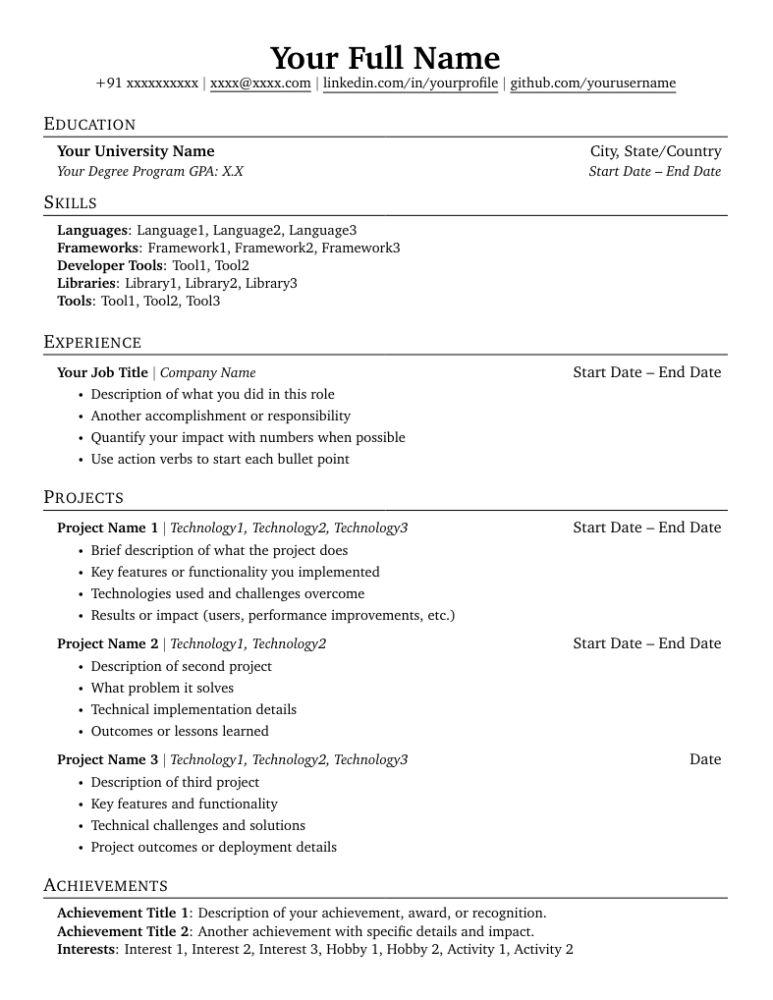

# LaTeX Resume Creator


A flexible LaTeX resume generator that uses JSON data and Jinja2 templating to create resumes. Based on Jake's resume template. I built this application because it was tedious to manage multiple resumes for different applications.

## Features

- **JSON-based data**: Store all your resume information in a simple JSON file
- **Template customization**: Modify the LaTeX template to change the layout and styling
- **Selective content**: Enable/disable specific experiences, projects, and achievements for different applications
- **Privacy controls**: Hide personal information like phone and email by storing them in a `.env` file
- **Automated builds**: GitHub Actions automatically generates your PDF when you push changes, so no need to install LaTeX on your system.
- **Docker support**: You can also run the application locally without installing LaTeX and other dependencies manually.
- **Multiple resume versions**: Easy to maintain different versions for different job applications

## How to run? 
### Run via GitHub Actions

Fork this repository and make your changes. Once you push it to the `master` branch, GitHub Actions will automatically trigger to build your resume.

Visit the Actions tab on your forked repo to track the build. Once completed, you can download the PDF from the "Upload PDF artifact" step in the build-pdf job.

If you do not want to re-generate the resume on each push, maintain a `develop` branch, then whenever you want a pdf, merge with the `master` branch.

### To run locally
#### Build the docker image

```bash
docker build . -t resume
```

#### Run the application

Either run the provided script `build.sh` with
```bash
./build.sh
```
Or execute the command:

```bash
docker run -it \
--env-file .env \
-v $(pwd)/output:/output \
-v $(pwd)/src/resume_creator:/app/src/resume_creator \
resume
```
Note: It will take some time (a few minutes) to install the required tex packages.

#### Privacy Controls

Set environment variables to control personal information:

```bash
export SHOW_PERSONAL_INFO=1
export PHONE="+1234567890"
export EMAIL="your.email@example.com"
```
Then follow the above steps to generate the resume with your phone number and email.

## How to customize it?
- Edit `src/resume_creator/data/resume.json` to resume content
- Edit `src/resume_creator/templates/resume.tex` to change the layout of the resume
- Use fields in `enabled` in `resume.json` to toggle which items appear in the final PDF

## Preview

A sample resume was generated with dummy data. You can view it in `readme/` directory.



## Credits

Built on top of these LaTeX resume templates:
- [Jake's resume](https://github.com/jakegut/resume)
- [sb2nov's resume](https://github.com/sb2nov/resume/)
